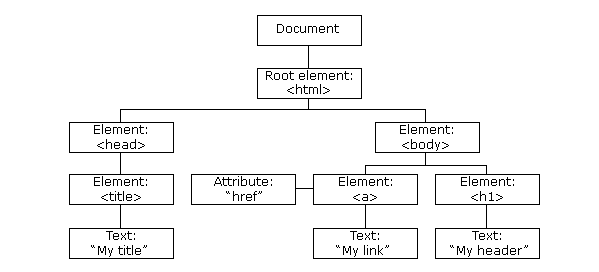

# HTML5 Interview Questions and Answers

*Click  if you like the project.


<br/>

|Sl.No|  Questions                        |
|----|------------------------------------|
| 01.|[What is the WHATWG?](#q-what-is-the-WHATWG)|
| 02.|[What is an iframe and how it works?](#q-what-is-an-iframe-and-how-it-works?)|
| 03.|[How do you set language in HTML?](#q-how-do-you-set-language-in-HTML?)|
| 04.|[What is the DOM? How does the DOM work?](#q-what-is-the-dom-how-does-the-dom-work)|
| 05.|[How does the browser rendering engine work?](#q-how-does-the-browser-rendering-engine-work)|
| 06.|[What does a `<DOCTYPE html>` do?](#q-what-does-a-doctype-html-do)|
| 07.|[What happens when DOCTYPE is not given?](#q-what-happens-when-doctype-is-not-given)|
| 08.|[What are the building blocks of HTML5?](#q-what-are-the-building-blocks-of-html5)|
| 09.|[Describe the difference between a `cookie`, `sessionStorage` and `localStorage`?](#q-describe-the-difference-between-a-cookie-sessionstorage-and-localstorage)
| 10.|[What are the Benefits of Server Side Rendering (SSR) Over Client Side Rendering (CSR)?](#q-what-are-the-benefits-of-server-side-rendering-ssr-over-client-side-rendering-csr)|
| 11.|[What is the difference between a `<span>` and a `<div>`?](#q-what-is-the-difference-between-a-span-and-a-div)|
| 12.|[Name 5 common block-level and inline HTML elements?](#q-name-5-common-block-level-and-inline-html-elements)|
| 13.|[What are semantic and non-semantic elements?](#q-what-are-semantic-and-non-semantic-elements)|
| 14.|[What is the purpose of `main` element?](#q-what-is-the-purpose-of-main-element)|
| 15.|[Define semantic markup. What are the semantic meanings for `<section>, <article>, <aside>, <nav>, <header>, <footer>` and when/how should each be used in structuring html markup?](#q-define-semantic-markup-what-are-the-semantic-meanings-for-section-article-aside-nav-header-footer-and-when-how-should-each-be-used-in-structuring-html-markup)|
| 16.|[When should you use `section`, `div` or `article`?](#q-when-should-you-use-section-div-or-article)|
| 17.|[What is Character Encoding?](#q-what-is-character-encoding)|
| 18.|[What is the purpose of meta tags?](#q-what-is-the-purpose-of-meta-tags)|
| 19.|[What does CORS stand for and what issue does it address?](#q-what-does-cors-stand-for-and-what-issue-does-it-address)|
| 20.|[What does async and defer refer in script tag? Describe the difference between `<script>`, `<script async>` and `<script defer>`](#q-what-does-async-and-defer-refer-in-script-tag-describe-the-difference-between-script-script-async-and-script-defer)|
| 21.|[Ways to improve website performance](#q-ways-to-improve-website-performance)|
| 22.|[Comparison of browsers engines like Chrome, Firefox, Internet explorer, Safari?](#q-comparison-of-browsers-engines-like-chrome-firefox-internet-explorer-safari)|
| 23.|[What are `data-` attributes good for?](#q-what-are-data-attributes-good-for)|
| 24.|[Explain the difference between layout, painting and compositing?](#q-explain-the-difference-between-layout-painting-and-compositing)|
| 25.|[Explain about HTML Layout Engines used by browsers?](#q-explain-about-html-layout-engines-used-by-browsers)|

<br/>


## Q. ***What is the WHATWG??***
-   The Web Hypertext Application Technology Working Group (WHATWG) is a community of people interested in evolving the web through standards and tests.
-   The WHATWG was founded by individuals of Apple, the Mozilla Foundation, and Opera Software in 2004, after a W3C workshop. Apple, Mozilla and Opera were becoming increasingly concerned about the W3C’s direction with XHTML, lack of interest in HTML, and apparent disregard for the needs of real-world web developers. So, in response, these organisations set out with a mission to address these concerns and the Web Hypertext Application Technology Working Group was born

## Q. ***What is an iframe and how it works?***
* An iframe is an HTML document which can be embedded inside another HTML page
**Example:*
```html
<iframe src="https://github.com" height="300px" width="300px"></iframe>
```

## Q. ***How do you set language in HTML?***
There are multiple ways to set language in HTML
*   By setting content-language in headers for language of the page
*   By setting accept-language in headers for list of language that a page accept
*   Setting lang attribute in html tag

**Example:**
```HTML
<!DOCTYPE html>
<html lang="en">
<head>
  <title>Document Title</title>
</head>
<body>

</body>
</html>
```

## Q. ***What is the DOM? How does the DOM work?*** 

***The W3C Document Object Model (DOM) is a platform and language-neutral interface that allows programs and scripts to dynamically access and update the content, structure, and style of a document.***

Confused? Let me make that simple. Imagine that, every web page is a document and every element( be it text or image or table) inside that webpage is stored in that document as an object in a tree format, which can be manipulated later with a scripting language such as JavaScript. \
 \
Now, when a web page is loaded, the browser creates such a document every time which is called, Document Object Model (DOM) of the page.\
The DOM represents the document as nodes and objects so that programs can change the document structure, style, and content. In that hat way, programming languages connect to the webpage.
<div align="right">
    <b><a href="#">↥ back to top</a></b>
</div>


## Q. ***How does the browser rendering engine work?***

In order to render content the browser has to go through a series of steps:

* Document Object Model(DOM)
* CSS object model(CSSOM)
* Render Tree
* Layout
* Paint


<div align="right">
    <b><a href="#">↥ back to top</a></b>
</div>

## Q. ***What does a `<DOCTYPE html>` do?***

Doctype is the abbreviation for the “Document type”. The very first line in every web document should contain a <!DOCTYPE html> declaration. \
The purpose of DOCTYPE is to tell the browser what type of HTML you are writing. It is not valid to omit the DOCTYPE. There is no “Standard” format. The browser will just try to parse HTML as best it can. But not all elements will be displayed correctly. DOCTYPE is a required part of all HTML documents.\
To render a HTML4.01 document, use this code at the very top of your document:
```HTML
<!DOCTYPE HTML PUBLIC “-//W3C//DTD HTML 4.01//EN” “http://www.w3.org/TR/html4/strict.dtd">
```
To render a HTML5 document, include this code instead:\
<!doctype html>\
The Doctype declaration informs the web browser about the type and version of HTML used in building the web document (e.g. HTML5, HTML4.0, XHTML1.0)\
<div align="right">
    <b><a href="#">↥ back to top</a></b>
</div>

## Q. ***What happens when DOCTYPE is not given?***

The web page is rendered in quirks mode. The web browsers engines use quirks mode to support older browsers which does not follow the **W3C specifications**. In quirks mode CSS class and id names are case insensitive. In standards mode they are case sensitive.
<div align="right">
    <b><a href="#">↥ back to top</a></b>
</div>

## Q. ***What are the building blocks of HTML5?***

* **Semantics**: allowing you to describe more precisely what your content is.
* **Connectivity**: allowing you to communicate with the server in new and innovative ways.
* **Offline and storage**: allowing webpages to store data on the client-side locally and operate offline more efficiently.
* **Multimedia**: making video and audio first-class citizens in the Open Web.
* **2D/3D graphics and effects**: allowing a much more diverse range of presentation options.
* **Performance and integration**: providing greater speed optimization and better usage of computer hardware.
* **Device access**: allowing for the usage of various input and output devices.
* **Styling**: letting authors write more sophisticated themes.

## Q. ***Describe the difference between a `cookie`, `sessionStorage` and `localStorage`?***

**localStorage:** localStorage is a way to store data on the client’s computer. It allows the saving of key/value pairs in a web browser and it stores data with no expiration date. localStorage can only be accessed via JavaScript, and HTML5. However, the user has the ability to clear the browser data/cache to erase all localStorage data.

**SessionStorage:**  stores data only for a session, meaning that the data is stored until the browser (or tab) is closed.

**cookie:** Stores data that has to be sent back to the server with subsequent XHR requests. Its expiration varies based on the type and the expiration duration can be set from either server-side or client-side .

|                                        | `cookie`                                                 | `localStorage` | `sessionStorage` |
| -------------------------------------- | -------------------------------------------------------- | -------------- | ---------------- |
| Initiator                              | Client or server. Server can use `Set-Cookie` header     | Client         | Client           |
| Expiry                                 | Manually set                                             | Forever        | On tab close     |
| Persistent across browser sessions     | Depends on whether expiration is set                     | Yes            | No               |
| Sent to server with every HTTP request | Cookies are automatically being sent via `Cookie` header | No             | No               |
| Capacity (per domain)                  | 4kb                                                      | 5MB            | 5MB              |
| Accessibility                          | Any window                                               | Any window     | Same tab         |


*Note: If the user decides to clear browsing data via whatever mechanism provided by the browser, this will clear out any `cookie`, `localStorage`, or `sessionStorage` stored. It's important to keep this in mind when designing for local persistance, especially when comparing to alternatives such as server side storing in a database or similar (which of course will persist despite user actions).*

<div align="right">
    <b><a href="#">↥ back to top</a></b>
</div>


## Q. ***What are the Benefits of Server Side Rendering (SSR) Over Client Side Rendering (CSR)?***

* We are using server side rendering for two reasons:
    * performance benefit for our customers
    * Consistent SEO performance

* The main difference is that for SSR your server’s response to the browser is the HTML of your page that is ready to be rendered, while for CSR the browser gets a pretty empty document with links to your javascript. That means for SSR your browser will start rendering the HTML from your server without having to wait for all the JavaScript to be downloaded and executed.
    
* for SSR, the user can start viewing the page while all of that is happening. For the CSR world, you need to wait for all of the above to happen and then have the virtual dom moved to the browser dom for the page to be viewable.

## Q. ***What is the difference between a `<span>` and a `<div>`?***

* `<div>` is a block level element which means it will render it on it's own line with a width of a 100% of the parent element.
* `<span>` is an inline element which means it will render on the same line as the previous element, if it is also an inline element, and it's width will be determined by it's content.

## Q. ***Name 5 common block-level and inline HTML elements?***

* block elements `<h1>, <p>, <ul>, <ol>, <li>`,
* inline elements `<span>, <a>, <strong>, <i>, `

<div align="right">
    <b><a href="#">↥ back to top</a></b>
</div>

## Q. ***What are semantic and non-semantic elements?***

* **Semantic elements**: clearly describes its meaning to both the browser and the developer. For example: `<form>`, `<table>`,  `<article>`, `<aside>`, `<details>`, `<figcaption>`, `<figure>`, `<footer>`, `<header>`, `<main>`, `<mark>`, `<nav>`, `<section>`, `<summary>`, `<time>` clearly defines its content.
  
* **Non-semantic elements**: `<div>` and `<span>` tells nothing about its content. 

## Q. ***What is the purpose of `main` element?***

The HTML `<main>` element represents the dominant content of the `<body>` of a document. The main content area consists of content that is directly related to or expands upon the central topic of a document, or the central functionality of an application.

```html
<main role="main">
    <p>Geckos are a group of usually small, usually nocturnal lizards. 
       They are found on every continent except Australia.</p>
    <p>Many species of gecko have adhesive toe pads which enable them to climb walls and even windows.</p>
</main>
```

*Note: A document mustn\'t have more than one `<main>` element that doesn't have the hidden attribute specified.*

<div align="right">
    <b><a href="#">↥ back to top</a></b>
</div>

## Q. ***Define semantic markup. What are the semantic meanings for `<section>, <article>, <aside>, <nav>, <header>, <footer>` and when/how should each be used in structuring html markup?***

* `<header>` is used to contain introductory and navigational information about a section of the page. This can include the section heading, the author’s name, time and date of publication, table of contents, or other navigational information.

* `<article>` is meant to house a self-contained composition that can logically be independently recreated outside of the page without losing it’s meaining. Individual blog posts or news stories are good examples.

* `<section>` is a flexible container for holding content that shares a common informational theme or purpose.

* `<footer>` is used to hold information that should appear at the end of a section of content and contain additional information about the section. Author’s name, copyright information, and related links are typical examples of such content.

## Q. ***When should you use `section`, `div` or `article`?***

* `<section>`, group of content inside is related to a single theme, and should appear as an entry in an outline of the page. It’s a chunk of related content, like a subsection of a long article, a major part of the page (eg the news section on the homepage), or a page in a webapp’s tabbed interface. A section normally has a heading (title) and maybe a footer too.

* `<article>`, represents a complete, or self-contained, composition in a document, page, application, or site and that is, in principle, independently distributable or reusable, e.g. in syndication. This could be a forum post, a magazine or newspaper article, a blog entry, a user-submitted comment, an interactive widget or gadget, or any other independent item of content.

* `<div>`, on the other hand, does not convey any meaning, aside from any found in its class, lang and title attributes.

<div align="right">
    <b><a href="#">↥ back to top</a></b>
</div>

## Q. ***What is Character Encoding?***

Character encoding is a method of converting bytes into characters. To validate or display an HTML document properly, a program must choose a proper character encoding. This is specified in the tag:

```html
<meta charset="utf-8"/>
```

* **UTF-8**: A Unicode Translation Format that comes in 8-bit units that is, it comes in bytes. A character in UTF8 can be from 1 to 4 bytes long, making UTF8 variable width.

## Q. ***What is the purpose of meta tags?***

The META elements can be used to include name/value pairs describing properties of the HTML document, such as author, expiry date, a list of keywords, document author etc.

```html
<!DOCTYPE html>
<html>
  <head>
        <!--Recommended Meta Tags-->
        <meta charset="utf-8">
        <meta name="language" content="english"> 
        <meta http-equiv="content-type" content="text/html">
        <meta name="author" content="Author Name">
        <meta name="designer" content="Designer Name">
        <meta name="publisher" content="Publisher Name">
        <meta name="no-email-collection" content="name@email.com">
        <meta http-equiv="X-UA-Compatible" content="IE=edge"/>

        <!--Search Engine Optimization Meta Tags-->
        <meta name="description" content="Project Description">
        <meta name="keywords" content="Software Engineer,Product Manager,Project Manager,Data Scientist">
        <meta name="robots" content="index,follow">
        <meta name="revisit-after" content="7 days">
        <meta name="distribution" content="web">
        <meta name="robots" content="noodp">
        
        <!--Optional Meta Tags-->
        <meta name="distribution" content="web">
        <meta name="web_author" content="">
        <meta name="rating" content="">
        <meta name="subject" content="Personal">
        <meta name="title" content=" - Official Website.">
        <meta name="copyright" content="Copyright 2020">
        <meta name="reply-to" content="">
        <meta name="abstract" content="">
        <meta name="city" content="Bangalore">
        <meta name="country" content="INDIA">
        <meta name="distribution" content="">
        <meta name="classification" content="">
    
        <!--Meta Tags for HTML pages on Mobile-->
        <meta name="format-detection" content="telephone=yes"/>
        <meta name="HandheldFriendly" content="true"/> 
        <meta name="viewport" content="width=device-width, initial-scale=1.0"/> 
        <meta name="apple-mobile-web-app-capable" content="yes" />
        
        <!--http-equiv Tags-->
        <meta http-equiv="Content-Style-Type" content="text/css">
        <meta http-equiv="Content-Script-Type" content="text/javascript">
      
    <title>HTML5 Meta Tags</title>
  </head>
  <body>
       ...
  </body>
</html>
```
<div align="right">
    <b><a href="#">↥ back to top</a></b>
</div>

## Q. ***What does CORS stand for and what issue does it address?***

Cross-Origin Resource Sharing (CORS) is a W3C spec that allows cross-domain communication from the browser. By building on top of the XMLHttpRequest object, CORS allows developers to work with the same idioms as same-domain requests. CORS gives web servers cross-domain access controls, which enable secure cross-domain data transfers.

## Q. ***What does async and defer refer in script tag? Describe the difference between `<script>`, `<script async>` and `<script defer>`***

* **Async**: Downloads the script file during HTML parsing and will pause the HTML parser to execute it when it has finished downloading.

* **Defer**: Defer downloads the script file during HTML parsing and will only execute it after the HTML parser has completed. Not all browsers support this.
    
The async attribute is used to indicate to the browser that the script file can be executed asynchronously. The HTML parser does not need to pause at the point it reaches the script tag to fetch and execute, the execution can happen whenever the script becomes ready after being fetched in parallel with the document parsing.

The defer attribute tells the browser to only execute the script file once the HTML document has been fully parsed.     

<div align="right">
    <b><a href="#">↥ back to top</a></b>
</div>


## Q. ***Ways to improve website performance***

* Minimize HTTP Requests
    * Sites are mainly slow because of too many (or too large) HTTP requests. We can eliminate unnecessary request;
        * combined files: js to a file, css to a file
        * CSS sprites: CSS Sprites are the preferred method for reducing the number of image requests. Combine your background images into a single image and use the CSS background-image and background-position properties to display the desired image segment.

* Use a Content Delivery Network CDN

    * A CDN is essentially many optimized servers around the world that deliver web content to users based on their geographic location. This means big performance improvements for site users. Because, say, if a person accessing your site in India, they will be retrieving web content from a server nearby

* Optimize Images:

    * image sizes make a huge difference to site speed. The larger content/images, the slower the site. we could:
        * Changing the resolution: reducing the “quality” of the image (and thereby the file size)
        * Compressing the picture: increasing the efficiency of image data storage
        * Cropping the picture: when cropping, you are cutting out unneeded areas and thus making the image smaller in size

* Put Scripts at the Bottom:

    * Javascript files can load after the rest of your page. The simplest solution is to place your external Javascript files at the bottom of your page, just before the close of your body tag. Now more of your site can load before your scripts. Another method that allows even more control is to use the defer or async attributes when placing external .js files on your site.
        
        * Async tags load the scripts while the rest of the page loads, but this means scripts can be loaded out of order. Basically, lighter files load first. This might be fine for some scripts, but can be disastrous for others.
        
        * The defer attribute loads your scripts after your content has finished loading. It also runs the scripts in order. Just make sure your scripts run so late without breaking your site.

* Add an Expires or a Cache-Control Header

    * Web page designs are getting richer and richer, which means more scripts, stylesheets, images, and Flash in the page. A first-time visitor to your page may have to make several HTTP requests, but by using the Expires header you make those components cacheable. This avoids unnecessary HTTP requests on subsequent page views. Expires headers are most often used with images, but they should be used on all components including scripts, stylesheets, and Flash components.

* Gzip Components

    * Compression reduces response times by reducing the size of the HTTP response. Gzipping generally reduces the response size by about 70%.

* Put Stylesheets at the Top:

    * This is because putting stylesheets in the HEAD allows the page to render progressively.

* Avoid CSS Expressions

* Use GET for AJAX Requests:

    * Ajax is that it provides instantaneous feedback to the user because it requests information asynchronously from the backend web server

* Make JavaScript and CSS External:

    *  Using external files in the real world generally produces faster pages because the JavaScript and CSS files are cached by the browser. JavaScript and CSS that are inlined in HTML documents get downloaded every time the HTML document is requested. This reduces the number of HTTP requests that are needed, but increases the size of the HTML document. On the other hand, if the JavaScript and CSS are in external files cached by the browser, the size of the HTML document is reduced without increasing the number of HTTP requests.

* Use get to ajax request:

    *  POST is implemented in the browsers as a two-step process: sending the headers first, then sending data. So it's best to use GET, which only takes one TCP packet to send (unless you have a lot of cookies).

* No 404s:

    * HTTP requests are expensive so making an HTTP request and getting a useless response (i.e. 404 Not Found) is totally unnecessary and will slow down the user experience without any benefit.

* Reduce Cookie Size:

    * HTTP cookies are used for a variety of reasons such as authentication and personalization. Information about cookies is exchanged in the HTTP headers between web servers and browsers. It's important to keep the size of cookies as low as possible to minimize the impact on the user's response time.

* Reduce DNS Lookups
* Minify JavaScript and CSS
* Avoid Redirects
* Remove Duplicate Scripts
* Configure Etags
* Make Ajax Cacheable
* Post-load Components
* Preload Components
* Reduce the Number of DOM Elements
* Minimize the Number of iframes
* Minimize DOM Access
* Optimize CSS Sprites
* Don't Scale Images in HTML
* Make favicon.ico Small and Cacheable
* Avoid Empty Image src

<div align="right">
    <b><a href="#">↥ back to top</a></b>
</div>

## Q. ***Comparison of browsers engines like Chrome, Firefox, Internet explorer, Safari?***

* Chrome: 
    * Layout rendering engine **Webkit**. 
    * JavaScript engine **V8**

* Firefox: 
    * Layout rendering engine **Gecko**. 
    * JavaScript engine **Spider monkey**
        
* Internet explorer: 
    * Layout rendering engine **Trident**. 
    * JavaScript  engine **Chakra**
        
* Safari:
    * Layout rendering engine **Webkit**. 
    * JavaScript engine JavascriptCore i.e **Nitro**


## Q. ***What are `data-` attributes good for?***

* The HTML5 data attribute lets you assign custom data to an element. When we want to store more information/data about the element when no suitable HTML5 element or attribute exists


## Q. ***Explain the difference between layout, painting and compositing?***


* **JavaScript**: Typically JavaScript is used to handle work that will result in visual changes, whether it’s jQuery’s animate function, sorting a data set, or adding DOM elements to the page. It doesn’t have to be JavaScript that triggers a visual change, though: CSS Animations, Transitions, and the Web Animations API are also commonly used.
* **Style calculations**: This is the process of figuring out which CSS rules apply to which elements based on matching selectors, for example, .headline or .nav > .nav__item. From there, once rules are known, they are applied and the final styles for each element are calculated.
* **Layout**: Once the browser knows which rules apply to an element it can begin to calculate how much space it takes up and where it is on screen. The web’s layout model means that one element can affect others, for example the width of the <body> element typically affects its children’s widths and so on all the way up and down the tree, so the process can be quite involved for the browser.
* **Paint**: Painting is the process of filling in pixels. It involves drawing out text, colors, images, borders, and shadows, essentially every visual part of the elements. The drawing is typically done onto multiple surfaces, often called layers.
* **Compositing**: Since the parts of the page were drawn into potentially multiple layers they need to be drawn to the screen in the correct order so that the page renders correctly. This is especially important for elements that overlap another, since a mistake could result in one element appearing over the top of another incorrectly.

<div align="right">
    <b><a href="#">↥ back to top</a></b>


## Q. ***Explain about HTML Layout Engines used by browsers?***

|Engine	      |Status	        |Embedded in                                                                           |
|-------------|-----------------|--------------------------------------------------------------------------------------|
|WebKit	      |Active	        |Safari browser, plus all browsers hosted on the iOS App Store                         |
|Blink	      |Active	        |Google Chrome and all other Chromium-based browsers like Opera and Microsoft Edge     |
|Gecko	      |Active	        |Firefox browser and Thunderbird email client, plus forks like SeaMonkey and Waterfox  |
|KHTML	      |Discontinued	  |Konqueror browser                                                                     |
|Presto	      |Discontinued	  |formerly in the Opera browser                                                         |
|EdgeHTML	  |Discontinued	  |formerly in the Microsoft Edge browser                                                |
|Trident	  |Discontinued	  |Internet Explorer browser and Microsoft Outlook email client                          |

<div align="right">
    <b><a href="#">↥ back to top</a></b>
</div>